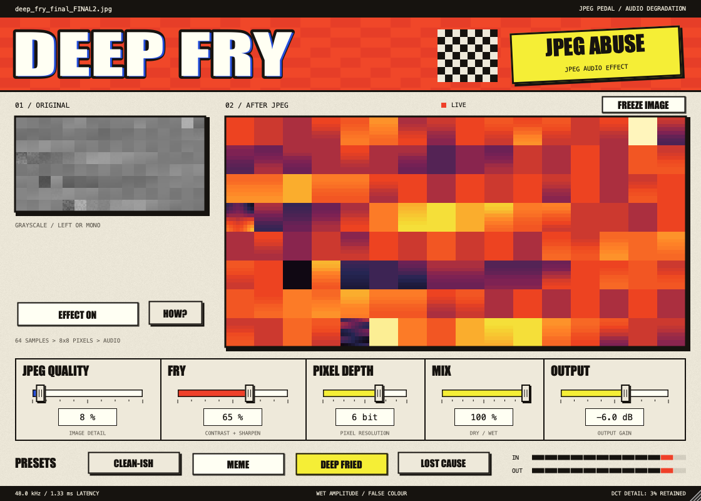

# Deep Fry

**Turn audio into pixels. Ruin the image. Play it back.**

A native audio effect inspired by over-compressed, over-sharpened memes. Deep Fry maps audio into grayscale images and runs the lossy stages of JPEG compression on them. The same pixels you see in the editor are decoded into the audio you hear.



The interface borrows from image macros and old image-export dialogs: an outlined Impact wordmark, printed cream panels, red compression blocks, square sliders, and an unobstructed live processed image. See the [visual style notes](docs/visual-style.md).

Built in C++17 with JUCE 8.0.13. Builds VST3 and standalone applications, plus Audio Unit on macOS. Mono and stereo input are supported; each channel is processed independently.

See [validation results](docs/validation.md) for the tested configurations.

## Try it on macOS

Download `Deep-Fry-0.1.0-macOS-universal.zip` from the [0.1.0 release](https://github.com/mitchaiet/deep-fry/releases/tag/v0.1.0). This preview requires **macOS 26.2 or later** and contains both Apple Silicon and Intel code. Extract the entire ZIP, save and close your DAW, then run `Install.command`. It installs VST3 and Audio Unit into your user plugin folders and the standalone app into `~/Applications`, preserving backups of existing copies.

The bundles are ad-hoc signed and are **not notarized**. macOS may block downloaded copies. The installer does not change Gatekeeper settings; source build instructions are below.

In Ableton Live 11, open **Preferences → Plug-Ins**, enable **Use VST3 Plug-In System Folders**, and click **Rescan**. Find **Deep Fry** in the Plug-Ins browser and drag it onto an audio track. The standalone app offers JUCE's audio-device settings; choose your interface and input there.

Start with **Meme**, play audio through it, and lower **JPEG Quality** to hear the block artifacts. **Deep fried** and **Lost cause** push into hard distortion and very coarse pixel steps. Use headphones when monitoring a microphone through the standalone app to avoid speaker feedback.

To build locally instead, install Xcode command-line tools, Git, and CMake 3.24+. The first configure needs an internet connection; JUCE is fetched automatically at a pinned release commit.

```sh
./scripts/build.sh
./scripts/install-macos.sh
open "build/DeepFry_artefacts/Release/Standalone/Deep Fry.app"
```

The source-tree `install-macos.sh` copies the VST3 and Audio Unit. The release's `Install.command` also installs the standalone app and keeps dated backups.

## Controls

| Control | What it changes |
| --- | --- |
| JPEG Quality | 1–100. Lower values discard more 2D image detail, producing block distortion, ringing, and rougher tones. 100 still passes through the pixel conversion. |
| Fry | 0–100%. Adds image contrast and four-neighbour sharpening before JPEG quantization. |
| Pixel Depth | 2–8 bits. Posterizes decoded pixels; fewer levels create harder digital steps. |
| Mix | Blends the processed signal with a latency-aligned dry signal. |
| Output | −24 to +6 dB, applied after the mix. |
| Bypass | Returns the latency-aligned dry signal at its original level. |
| Freeze | Holds the picture while the audio keeps processing. |

The four factory presets change the five sound controls and participate in host automation. Parameters and the selected program are saved in DAW sessions. Continuous controls are smoothed; intentional tile and pixel quantization steps remain part of the sound.

The original thumbnail and large processed display show recent **left-channel / mono** sample tiles, before image processing and after decoding, with a display palette. They show the wet processing path before Mix, Output, and Bypass. Each 8×8 block is an actual processed audio tile; the 128×64-pixel mosaic contains up to 128 recent tiles and updates with sampled tiles at approximately 60 tiles per second. Neutral gray represents silence in the original view. The coefficient meter reports how many of the 64 quantized DCT coefficients remain nonzero; it is not a JPEG file-size estimate. Signal displays stay unobstructed, with functional labels and an idle audio hint. Static print grain is decoration; the changing image pixels come from the audio processor.

## Signal path

```text
64 audio samples → 8×8 grayscale tile → contrast / sharpening
  → 2D DCT → JPEG luminance quantization → inverse DCT
  → pixel posterization → 64 audio samples → mix / output
```

This uses JPEG's standard luminance quantization table and IJG quality scaling. It does not create `.jpg` files in the audio callback: entropy coding and the file container are lossless and do not alter the decoded signal. Image processing is entirely in memory, with fixed storage and no file I/O, locks, or allocation in the audio processing path.

The audio mapping uses symmetric signed levels around gray 128, reserving exact zero at every bit depth. This produces `2^bits − 1` output levels (255 at 8 bits) and keeps digital silence silent. It is an audio-oriented variation on unsigned JPEG luminance conversion, not a byte-identical libjpeg round trip. Input beyond ±1 clips at the image conversion; dry and bypass preserve the original finite input. JPEG's tile boundaries are intentionally audible, and contrast/sharpening may alias at extreme settings.

Processing latency is **64 samples**, reported to the host: about 1.45 ms at 44.1 kHz or 1.33 ms at 48 kHz. Dry, wet, and bypass share that delay. The UI reads a bounded single-producer/single-consumer queue; closing or freezing the editor does not stop audio processing.

## Build and verify

```sh
cmake -S . -B build -DCMAKE_BUILD_TYPE=Release
cmake --build build --config Release --parallel 4
ctest --test-dir build -C Release --output-on-failure
```

On Windows use a Visual Studio 2022 C++ toolchain; build products are under `build/DeepFry_artefacts/Release/`. Copy the VST3 bundle to your VST3 directory. macOS builds are universal (Apple Silicon and Intel) by default; for a faster single-architecture development build, configure with `-DCMAKE_OSX_ARCHITECTURES=arm64` or `-DCMAKE_OSX_ARCHITECTURES=x86_64`. Windows and Linux builds have not been verified on this Mac.

To exercise just the dependency-free codec:

```sh
cmake -S . -B build-codec -DDEEPFRY_BUILD_PLUGIN=OFF -DCMAKE_BUILD_TYPE=Release
cmake --build build-codec
ctest --test-dir build-codec --output-on-failure
```

`DeepFryVerify --artifacts <directory>` runs the integration tests and generates dry/processed synthetic audio examples and a screenshot from the real native editor. With a single-config macOS build:

```sh
build/DeepFryVerify_artefacts/Release/DeepFryVerify --artifacts .context/preview
```

The codec tests cover silence at all settings, analytic quantization references, quality-dependent error, bounds, nonfinite input, and determinism. Integration checks cover timing, dry/bypass alignment, channel isolation, varying host buffers, presets, state restoration, and the visualization stream.

## Dependencies

JUCE is fetched from its [official repository](https://github.com/juce-framework/JUCE/tree/8.0.13). Included dependency licenses and source provenance are catalogued in [THIRD_PARTY_NOTICES.md](THIRD_PARTY_NOTICES.md). No license for Deep Fry's original code is granted by those third-party notices. The JPEG quantization reference is [libjpeg-turbo's parameter implementation](https://github.com/libjpeg-turbo/libjpeg-turbo/blob/main/src/jcparam.c).

## Package a macOS release

After building and testing the universal Release configuration:

```sh
./scripts/package-macos.sh
cd dist
shasum -a 256 -c Deep-Fry-0.1.0-macOS-universal.zip.sha256
```

The packager checks bundle versions, architectures, minimum OS, and code signatures, then writes the ZIP and SHA-256 checksum to `dist/`. The archive includes VST3, Audio Unit, standalone, an installer, and third-party notices. It packages an existing build without installing anything. This release script expects the current binaries' macOS 26.2 deployment target; a different target requires updating the package's compatibility checks and documentation.

For an isolated installer check, extract the ZIP and run `./Install.command --non-interactive --prefix /absolute/existing/test-directory` from its folder. The prefix receives its own `Library` and `Applications` directories. The installer never quits a running host.
